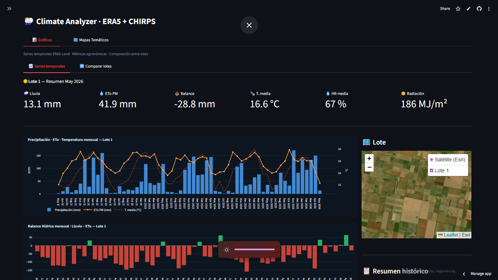
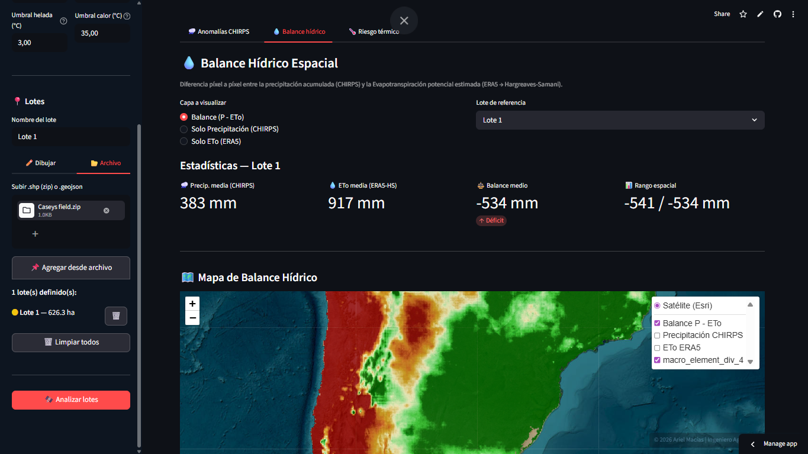
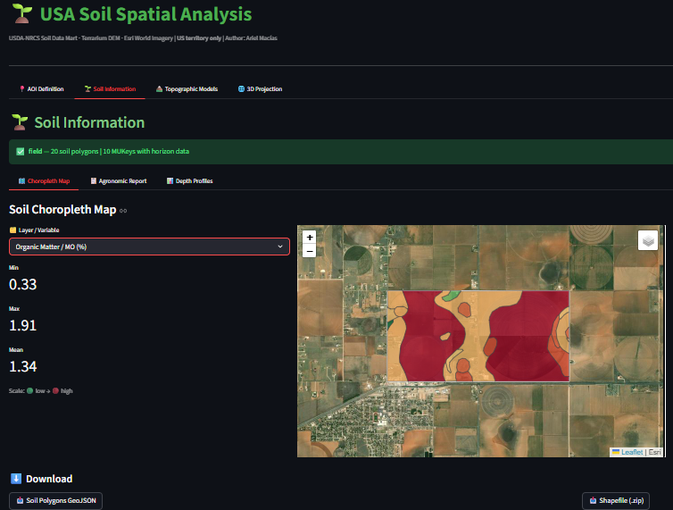
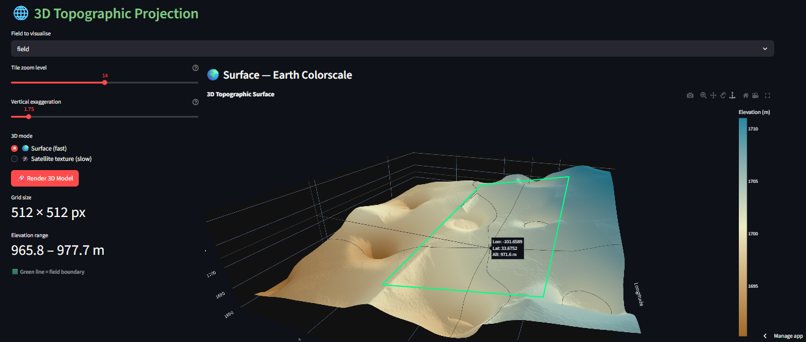
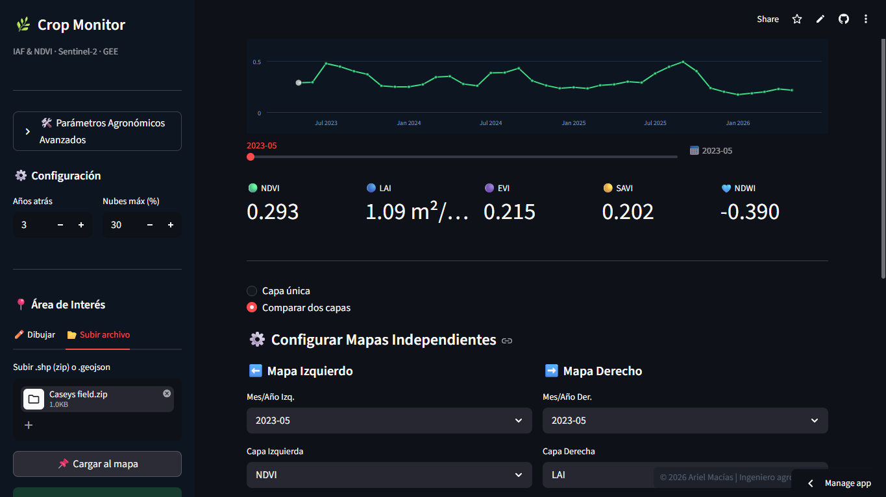
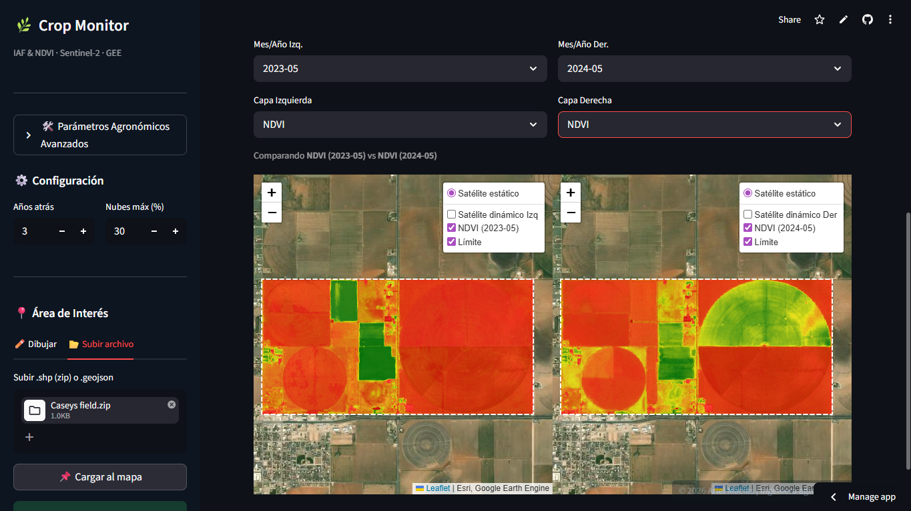

# 🌍 AgTech & GeoSpatial Data Science Portfolio

**Transformando datos espaciales y climáticos en soluciones agronómicas inteligentes.**

Este repositorio centraliza mis desarrollos en el ámbito de la **Agricultura Digital**, con un enfoque en el procesamiento de datos multiespectrales, modelado agrometeorológico y la creación de herramientas interactivas para la toma de decisiones a campo. 

Soy **Ingeniero Agrónomo** y **Analista SIG**, especializado en traducir necesidades agronómicas complejas en flujos de trabajo (*pipelines*) automatizados y productos mínimos viables (MVPs).

---

## 🚀 Proyectos Destacados

## 🌦️ [AgroClimatic Data Pipeline](https://github.com/Amaciasagro/GIT-RemoteSensing/blob/master/02_Climate_Analyzer/README.md)
Motor automatizado en Python para la extracción y procesamiento de variables climáticas satelitales.
* **Tecnologías:** Google Earth Engine (GEE), Python (Pandas, Shapely).
* **Impacto:** Implementación de un modelo algorítmico híbrido (ERA5 + CHIRPS) que optimiza la precisión en el cálculo de la Evapotranspiración (ETo de Penman-Monteith) y balances hídricos a escala de lote.

### Análisis estadístico
* 

### Mapas temáticos
* 

## 🗺️ [Soils Spatial Analysis Module](https://github.com/Amaciasagro/GIT-RemoteSensing/blob/master/01_USA_Soils_analysis/README.md)
Flujo de geoprocesamiento vectorial y análisis espacial avanzado para cartografía edáfica.
* **Tecnologías:** GeoPandas, Matplotlib, APIs de datos de suelos.
* **Impacto:** Sistema de consulta automatizada y estructuración de bases de datos de suelos (integrando datos de EE.UU.). Facilita la visualización y exportación de variables críticas para el diagnóstico territorial y la categorización de ambientes.

### Mapas temáticos por atributo  
* 

### Proyección topográfica 3D
* 

  
## 🌱 [Crop Remote Sensing Models](https://github.com/Amaciasagro/GIT-RemoteSensing/blob/master/03_CropMonitor/README.md)
Módulos analíticos orientados al monitoreo fenológico y estimación de biomasa mediante teledetección.
* **Tecnologías:** Python, procesamiento de bandas multiespectrales.
* **Impacto:** Cálculo masivo de índices vegetativos (NDVI, NDWI, EVI, SAVI) y modelado del Índice de Área Foliar (IAF) para la detección temprana de anomalías y caracterización productiva.

### Calculo de índices de vegetación y curva interactiva   
* 

### Comparación entre uno o más lotes  
* 

---

## 🛠️ Stack Tecnológico

* **Lenguajes & Entornos:** Python (Avanzado), Jupyter Notebooks, VS Code (Local), Google Colab (Cloud).
* **Ciencia de Datos & SIG:** GeoPandas, GEE API, Pandas, Shapely, QGIS.
* **Visualización:** Matplotlib, Folium, Streamlit, Plotly.
* **Control de Versiones:** Git & GitHub (Desarrollo colaborativo y versionado de código).

---

## 🎓 Formación y Certificaciones
* **Ingeniero Agrónomo** (FCA-UNNE).
* **Auxiliar Analista SIG** (Instituto Superior Escuela de Robótica e Inglés).
* **Fundamentals of Remote Sensing** (ARSET - NASA).
* **Análisis de Datos con Python orientado al agro** (UNC).

---

## 📬 Contacto
* **Ubicación:** Corrientes, Argentina (Disponible para proyectos globales y remotos).
* **LinkedIn:** [Ariel Macías](https://www.linkedin.com/in/ariel-macías-509b0718a)
* **Email:** amacias.agro@gmail.com

---
*Este repositorio es mantenido por Ariel Jorge Macías. El código está orientado a la reproducibilidad científica y el escalado de soluciones AgTech.*
